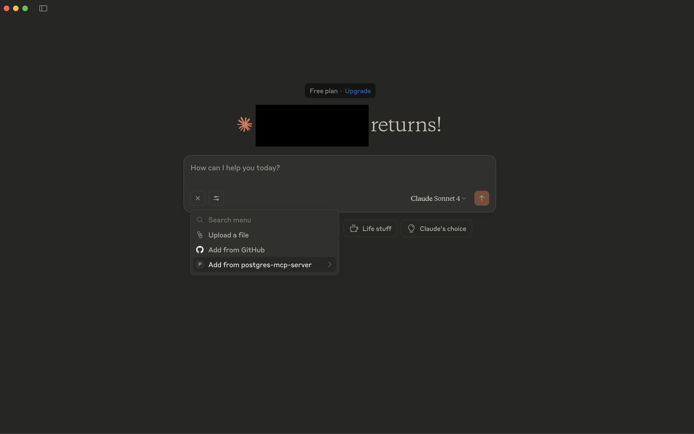
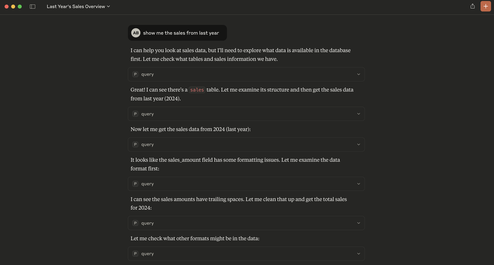
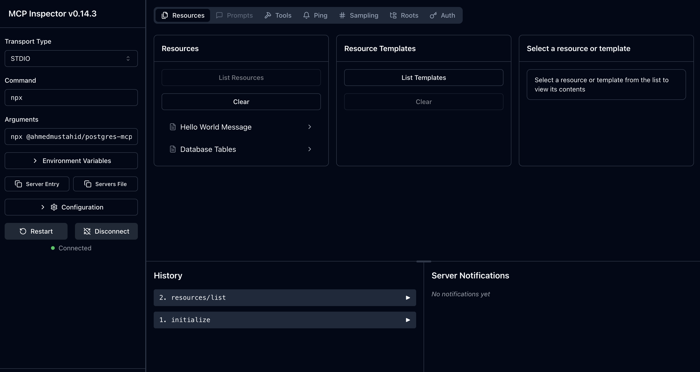
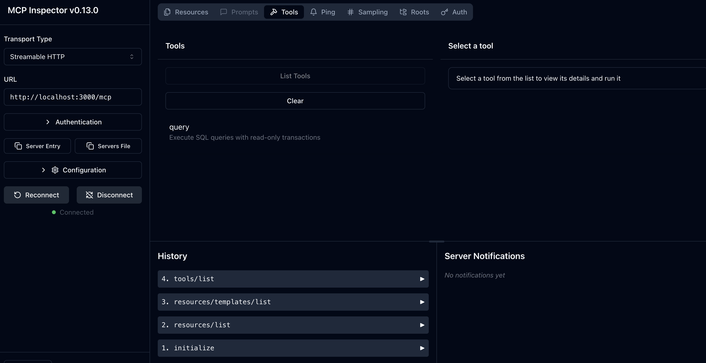
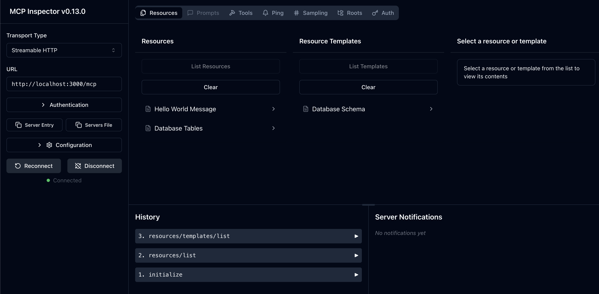

# MCP PostgreSQL Server (Stateful and Dual Transport)

A Model Context Protocol (MCP) server that provides both HTTP and Stdio transports for interacting with PostgreSQL databases. This server exposes database resources and tools through both transport methods, allowing for flexible integration in different environments.

## Features

- **Dual Transport Support**: Both HTTP (StreamableHTTPServerTransport) and Stdio (StdioServerTransport)
- **Database Resources**: List tables and retrieve schema information
- **Query Tool**: Execute read-only SQL queries
- **Stateful Sessions**: HTTP transport supports session management
- **Docker Support**: Containerized deployments for both transports
- **Production Ready**: Graceful shutdown, error handling, and logging

## Quick Start
### Environment Setup

The database credentials must be passed as:

1. Either environment variables
```bash
# PostgreSQL Database Configuration
export POSTGRES_USERNAME=your_username
export POSTGRES_PASSWORD=your_password
export POSTGRES_HOST=localhost
export POSTGRES_DATABASE=your_database

# HTTP Server Configuration
# Following are the default values
export PORT=3000
export HOST=0.0.0.0

# CORS Configuration (comma-separated list of allowed origins)
# Following are the default values
export CORS_ORIGIN=http://localhost:8080,http://localhost:3000

# Environment
# Following are the default values
export NODE_ENV=development

```
2. Or in the working directory (directory where `npx` command will be run):
create a `.env` file (the package uses `dotenv` package)

```bash
# .env.example
# PostgreSQL Database Configuration
POSTGRES_USERNAME=your_username
POSTGRES_PASSWORD=your_password
POSTGRES_HOST=localhost
POSTGRES_DATABASE=your_database

# HTTP Server Configuration
PORT=3000
HOST=0.0.0.0

# CORS Configuration (comma-separated list of allowed origins)
CORS_ORIGIN=http://localhost:8080,http://localhost:3000

# Environment
NODE_ENV=development
```

### Run using `npx`

1. Download node.js and npm from [here](https://docs.npmjs.com/downloading-and-installing-node-js-and-npm)
2. Run the package. By default, it will run streamable http on port 3000:
```bash
npx @ahmedmustahid/postgres-mcp-server@0.8.1
# or npx @ahmedmustahid/postgres-mcp-server@0.8.1 --port 3000 --verbose
```
3. For stdio transport:
```bash
npx @ahmedmustahid/postgres-mcp-server@0.8.1 stdio
# npx @ahmedmustahid/postgres-mcp-server@0.8.1 stdio --verbose
```

### Environment Setup

Copy environment template
```bash
cp .env.example .env
```

Edit your database credentials
```bash
nano .env
```

## Podman(or Docker) Usage

1. Install podman from [here](https://podman.io/docs/installation)
2. Install `uv` from [here](https://docs.astral.sh/uv/getting-started/installation/)
3. Install podman compose package: `uv add podman-compose` (or `uv sync` to sync packages in `pyproject.toml`)
```bash
#get the environment variables
set -a
source .env
set +a
podman machine start
make podman-up
```
## Test using Claude Desktop

First, install node.js and npm, build the project following the above instructions.
Edit your `claude_desktop_config.json`
```json
{
  "mcpServers": {
    "postgres-mcp-server": {
      "command": "npx",
      "args": [
        "@ahmedmustahid/postgres-mcp-server@0.8.1",
        "stdio"
      ],
      "env": {
        "POSTGRES_USERNAME": "your-username",
        "POSTGRES_PASSWORD": "your-password",
        "POSTGRES_HOST": "hostname",
        "POSTGRES_DATABASE": "database-name"
      }
    }
  }
}
```
#### Check if MCP Server has been enabled

Verify from Claude Desktop Window



#### Using MCP Server from Claude Desktop

Prompt: Show `sales` table from last year.




### Test using MCP Inspector

First, install node.js and npm, build the project following the above instructions.
Install MCP Inspector: instructions: [here](https://modelcontextprotocol.io/docs/tools/inspector)

#### Check Stdio MCP Server
```bash
npx @modelcontextprotocol/inspector npx  npx @ahmedmustahid/postgres-mcp-server@0.8.1 stdio
```


#### Check Streamable HTTP MCP Server

First, run the server (shell where environment has been configured):
```bash
npx @ahmedmustahid/postgres-mcp-server@0.8.1
```
Run the mcp inspector from another terminal
```bash
npx @modelcontextprotocol/inspector
```
After selecting `Streamable HTTP` from drop down menu, insert `http://localhost:3000/mcp`(default) into URL.

MCP tools:


MCP Resource:



## Configuration

### Environment Variables

You have to specify these inside the .env file.

| Variable | Description | Default | Required |
|----------|-------------|---------|----------|
| `POSTGRES_USERNAME` | PostgreSQL username | - | Yes |
| `POSTGRES_PASSWORD` | PostgreSQL password | - | Yes |
| `POSTGRES_HOST` | PostgreSQL host | - | Yes |
| `POSTGRES_DATABASE` | PostgreSQL database name | - | Yes |
| `PORT` | HTTP server port | 3000 | No |
| `HOST` | HTTP server host | 0.0.0.0 | No |
| `CORS_ORIGIN` | Allowed CORS origins (comma-separated) | localhost:8080,localhost:3000 | No |
| `NODE_ENV` | Environment mode | development | No |


## Resources

### Hello World (`hello://world`)
A simple greeting message for testing.

### Database Tables (`database://tables`)
Lists all tables in the public schema with their schema URIs.

### Database Schema (`database://tables/{tableName}/schema`)
Returns column information for a specific table.

## Tools

### query
Execute read-only SQL queries against the database.

**Parameters:**
- `sql` (string): The SQL query to execute


## Transport Differences

| Feature | HTTP Transport | Stdio Transport |
|---------|----------------|-----------------|
| Session Management | ✅ Stateful sessions | ❌ Stateless |
| Concurrent Connections | ✅ Multiple clients | ❌ Single process |
| Web Integration | ✅ REST API compatible | ❌ CLI only |
| Interactive Use | ✅ Via HTTP clients | ✅ Direct stdio |
| Docker Deployment | ✅ Web service | ✅ CLI container |

## Health Checks

The HTTP server includes a basic health check endpoint accessible at the `/health` endpoint with a GET request (returns 405 Method Not Allowed, confirming the server is responsive).

## Troubleshooting

### Common Issues

1. **Database Connection Errors**
   ```bash
   # Check your database credentials in .env
   # Ensure PostgreSQL is running and accessible
   ```

2. **Port Already in Use**
   ```bash
   # Change PORT in .env or stop conflicting services
   lsof -i :3000
   ```

3. **Docker Build Issues**
   ```bash
   # Clean Docker cache
   npm run docker:clean
   docker system prune -a
   ```

4. **Session Management (HTTP)**
   ```bash
   # Sessions are stored in memory and will reset on server restart
   # For production, consider implementing persistent session storage
   ```

## Development

### Adding New Resources

1. Create a new file in `src/resources/`
2. Implement the resource registration function
3. Add it to `src/server/server.ts`

### Adding New Tools

1. Create a new file in `src/tools/`
2. Implement the tool registration function
3. Add it to `src/server/server.ts`

## License

MIT

## Contributing

Please read the contributing guidelines and submit pull requests to the main repository.
