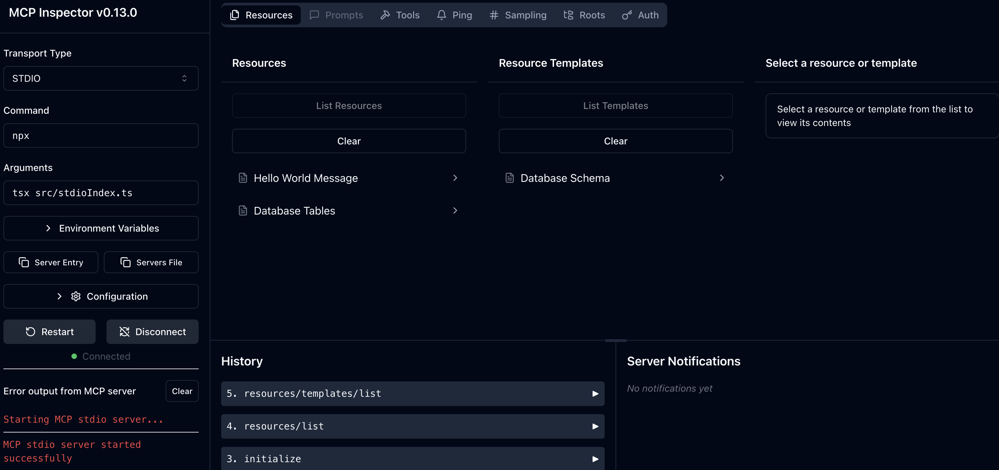

# MCP PostgreSQL Server (Stateful and Dual Transport)

A Model Context Protocol (MCP) server that provides both HTTP and Stdio transports for interacting with PostgreSQL databases. This server exposes database resources and tools through both transport methods, allowing for flexible integration in different environments.

## Features

- **Dual Transport Support**: Both HTTP (StreamableHTTPServerTransport) and Stdio (StdioServerTransport)
- **Database Resources**: List tables and retrieve schema information
- **Query Tool**: Execute read-only SQL queries
- **Stateful Sessions**: HTTP transport supports session management
- **Docker Support**: Containerized deployments for both transports
- **Production Ready**: Graceful shutdown, error handling, and logging

## Project Structure

```
postgres-mcp-server
├── Dockerfile                    # Main Docker container configuration for the MCP server
├── Makefile                      # Build automation and common development tasks
├── README.md                     # Project documentation and setup instructions
├── docker-compose.yml            # Production Docker Compose configuration
├── package.json                  # Node.js project configuration and dependencies
├── pyproject.toml               # Python project configuration
├── tsconfig.json                # TypeScript compiler configuration
└── src/
    ├── config/
    │   ├── database.ts          # Database connection configuration and setup
    │   └── env.ts               # Environment variable handling and validation
    ├── http/
    │   ├── Dockerfile           # Docker configuration specific to HTTP server mode
    │   ├── app.ts               # HTTP application setup and Express.js configuration
    │   └── httpHandler.ts       # HTTP request handlers for MCP protocol over HTTP
    ├── index.ts                 # Main entry point for the MCP server
    ├── resources/
    │   ├── databaseSchema.ts    # MCP resource for exposing database schema information
    │   ├── databaseTables.ts    # MCP resource for listing and describing database tables
    │   └── helloWorld.ts        # Example/test resource implementation
    ├── server/
    │   └── server.ts            # Core MCP server implementation and protocol handling
    ├── stdio/
    │   ├── Dockerfile           # Docker configuration for stdio communication mode
    │   └── stdioServer.ts       # MCP server configured for stdio communication
    ├── stdioIndex.ts            # Entry point for stdio-based MCP server
    └── tools/
        └── queryTool.ts         # MCP tool for executing PostgreSQL queries

```

## Quick Start

### 1. Environment Setup

Copy environment template
```bash
cp .env.example .env
```

Edit your database credentials
```bash
nano .env
```

### 2. Development

Download node.js and npm from [here](https://docs.npmjs.com/downloading-and-installing-node-js-and-npm)
```bash
# Install dependencies
npm install

# Build the project
npm run build
```
Run HTTP server in development
```bash
npm run dev:http -- --verbose
#or just
# npm run dev:http
```

Run Stdio server in development
```bash
npm run dev:stdio -- --verbose
#or just
# npm run dev:stdio
```

### 3. Production

Download node.js and npm from [here](https://docs.npmjs.com/downloading-and-installing-node-js-and-npm)

Build and start HTTP server
```bash
npm run build
npm run start:http -- --verbose
#or just
# npm run start:http
```

Or start Stdio server
```bash
npm run build
npm run start:stdio -- --verbose
#or just
# npm run start:stdio
```
## Podman Usage

1. Install podman from [here](https://podman.io/docs/installation)
2. Install `uv` from [here](https://docs.astral.sh/uv/getting-started/installation/)
3. Install podman compose package: `uv add podman-compose` (or `uv sync` to sync packages in `pyproject.toml`)
```bash
#get the environment variables
set -a
source .env
set +a
podman machine start
make podman-up
```
### Test using Claude Desktop

```json
{
  "mcpServers": {
    "postgres-mcp-server": {
      "command": "node",
      "args": [
        "/path/to/postgres-mcp-server/dist/src/stdioIndex.js"
      ],
      "env": {
        "POSTGRES_USERNAME": "your-username",
        "POSTGRES_PASSWORD": "your-password",
        "POSTGRES_HOST": "hostname",
        "POSTGRES_DATABASE": "database-name"
      }
    }
  }
}
```
#### Check if MCP Server has been enabled

Verify from Claude Desktop Window


#### Using MCP Server from Claude Desktop

Prompt: Show `sales` table from last year.


### Test using MCP Inspector

Install MCP Inspector: instructions: [here](https://modelcontextprotocol.io/docs/tools/inspector)

#### Check Stdio MCP Server
```bash
cd postgres-mcp-server/ #path to project directory
#from project directory
npx @modelcontextprotocol/inspector npx tsx src/stdioIndex.ts
```


#### Check Streamable HTTP MCP Server
1. Install podman from [here](https://podman.io/docs/installation)
2. Install `uv` from [here](https://docs.astral.sh/uv/getting-started/installation/)
3. Install podman compose package: `uv sync` (will sync packages in `pyproject.toml`)
```bash
#get the environment variables
set -a
source .env
set +a
#start podman container (if running for the first time)
make podman-up #will construct the container of the MCP server
#if already exists: podman start <name_of_the_container>
npx @modelcontextprotocol/inspector
```
After selecting `Streamable HTTP` from drop down menu, insert `http://localhost:3000/mcp` into URL.

MCP tools:


MCP Resource:


## Configuration

### Environment Variables

You have to specify these inside the .env file.

| Variable | Description | Default | Required |
|----------|-------------|---------|----------|
| `POSTGRES_USERNAME` | PostgreSQL username | - | Yes |
| `POSTGRES_PASSWORD` | PostgreSQL password | - | Yes |
| `POSTGRES_HOST` | PostgreSQL host | - | Yes |
| `POSTGRES_DATABASE` | PostgreSQL database name | - | Yes |
| `PORT` | HTTP server port | 3000 | No |
| `HOST` | HTTP server host | 0.0.0.0 | No |
| `CORS_ORIGIN` | Allowed CORS origins (comma-separated) | localhost:8080,localhost:3000 | No |
| `NODE_ENV` | Environment mode | development | No |


## Resources

### Hello World (`hello://world`)
A simple greeting message for testing.

### Database Tables (`database://tables`)
Lists all tables in the public schema with their schema URIs.

### Database Schema (`database://tables/{tableName}/schema`)
Returns column information for a specific table.

## Tools

### query
Execute read-only SQL queries against the database.

**Parameters:**
- `sql` (string): The SQL query to execute


## Transport Differences

| Feature | HTTP Transport | Stdio Transport |
|---------|----------------|-----------------|
| Session Management | ✅ Stateful sessions | ❌ Stateless |
| Concurrent Connections | ✅ Multiple clients | ❌ Single process |
| Web Integration | ✅ REST API compatible | ❌ CLI only |
| Interactive Use | ✅ Via HTTP clients | ✅ Direct stdio |
| Docker Deployment | ✅ Web service | ✅ CLI container |

## Health Checks

The HTTP server includes a basic health check endpoint accessible at the `/health` endpoint with a GET request (returns 405 Method Not Allowed, confirming the server is responsive).

## Troubleshooting

### Common Issues

1. **Database Connection Errors**
   ```bash
   # Check your database credentials in .env
   # Ensure PostgreSQL is running and accessible
   ```

2. **Port Already in Use**
   ```bash
   # Change PORT in .env or stop conflicting services
   lsof -i :3000
   ```

3. **Docker Build Issues**
   ```bash
   # Clean Docker cache
   npm run docker:clean
   docker system prune -a
   ```

4. **Session Management (HTTP)**
   ```bash
   # Sessions are stored in memory and will reset on server restart
   # For production, consider implementing persistent session storage
   ```

## Development

### Adding New Resources

1. Create a new file in `src/resources/`
2. Implement the resource registration function
3. Add it to `src/server/server.ts`

### Adding New Tools

1. Create a new file in `src/tools/`
2. Implement the tool registration function
3. Add it to `src/server/server.ts`

## License

MIT

## Contributing

Please read the contributing guidelines and submit pull requests to the main repository.
